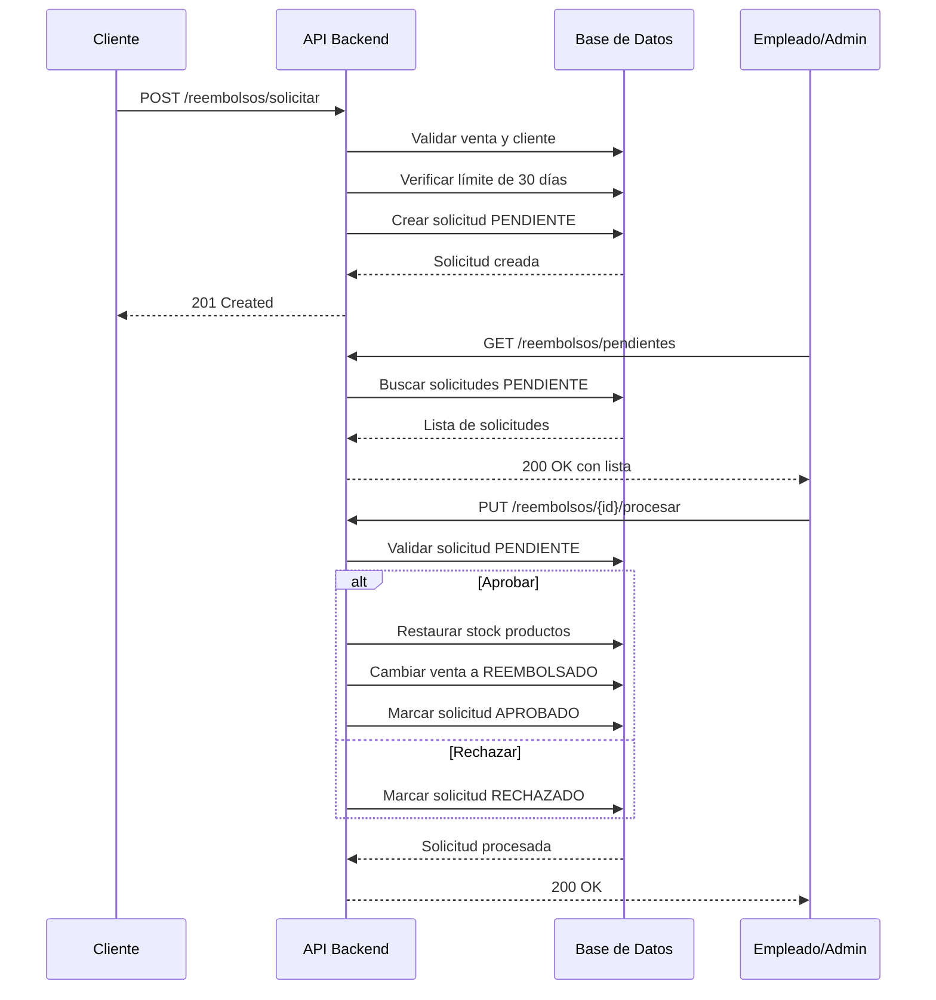

# Sistema de Reembolsos - Walkthrough

## Resumen

Se ha implementado exitosamente un sistema completo de reembolsos local para la aplicación Back-Soluciones-Webb. El sistema permite a los clientes solicitar reembolsos de sus compras dentro de un período de 30 días, y a los empleados/administradores revisar y procesar estas solicitudes, restaurando automáticamente el stock de productos cuando se aprueba un reembolso.

## ✅ Verificación de Endpoints

### Prueba Realizada: Endpoint de Reembolsos Pendientes

**Autenticación:**
```bash
curl -X POST http://localhost:8080/auth/login \
  -H "Content-Type: application/json" \
  -d '{"username":"admin","password":"admin"}'
```

**Respuesta:**
```json
{
  "message": "Login exitoso",
  "roles": ["EMPLEADO"],
  "token": "eyJhbGciOiJIUzI1NiJ9..."
}
```

**Consulta de Reembolsos Pendientes:**
```bash
curl -X GET http://localhost:8080/api/v1/reembolsos/pendientes \
  -H "Authorization: Bearer <token>"
```

**Respuesta Exitosa:**
```json
[
  {
    "id": 1,
    "idVenta": 40,
    "nombreCliente": "cliente1 cliente1 cliente1",
    "emailCliente": "cliente1@cliente.com",
    "totalVenta": 12.5,
    "motivo": "El producto llegó dañado",
    "estado": "PENDIENTE",
    "fechaSolicitud": "2025-12-03T20:23:09.092279",
    "fechaProcesamiento": null,
    "nombreEmpleadoProceso": null,
    "comentarioEmpleado": null
  }
]
```

✅ **Resultado:** El endpoint funciona correctamente y retorna las solicitudes pendientes con todos los campos esperados.

---

## Componentes Implementados

### 1. Modelo de Datos

#### [SolicitudReembolso.java](file:/src/main/java/com/example/web/models/venta/SolicitudReembolso.java)

Nueva entidad JPA que representa una solicitud de reembolso:

**Campos principales:**
- `id`: Identificador único de la solicitud
- `venta`: Relación ManyToOne con la venta a reembolsar
- `cliente`: Relación ManyToOne con el cliente que solicita
- `motivo`: Razón del reembolso (opcional, máx 500 caracteres)
- `estado`: Estado de la solicitud (PENDIENTE, APROBADO, RECHAZADO)
- `fechaSolicitud`: Fecha y hora de creación de la solicitud
- `fechaProcesamiento`: Fecha y hora cuando se procesó
- `procesadoPor`: Empleado que procesó la solicitud (opcional)
- `comentarioEmpleado`: Comentario del empleado al procesar (opcional, máx 500 caracteres)

---

### 2. Repositorio

#### [SolicitudReembolsoRepository.java](file:/src/main/java/com/example/web/repository/venta/SolicitudReembolsoRepository.java)

Repositorio JPA con métodos de consulta especializados:

**Métodos disponibles:**
- `findByVentaId`: Buscar todas las solicitudes de una venta específica
- `findByClienteIdOrderByFechaSolicitudDesc`: Buscar solicitudes de un cliente ordenadas por fecha
- `findByEstadoOrderByFechaSolicitudDesc`: Buscar solicitudes por estado
- `findSolicitudActivaByVentaId`: Verificar si existe una solicitud pendiente o aprobada para una venta
- `findByEstado`: Buscar todas las solicitudes con un estado específico

---

### 3. DTOs (Data Transfer Objects)

#### [SolicitudReembolsoRequest.java](file:/src/main/java/com/example/web/dto/reembolso/SolicitudReembolsoRequest.java)

DTO para que el cliente solicite un reembolso:
```json
{
  "idVenta": 123,
  "motivo": "Producto defectuoso"
}
```

#### [ProcesarReembolsoRequest.java](file:/src/main/java/com/example/web/dto/reembolso/ProcesarReembolsoRequest.java)

DTO para que el empleado/admin procese una solicitud:
```json
{
  "aprobar": true,
  "comentario": "Reembolso aprobado según política de la empresa"
}
```

#### [SolicitudReembolsoResponse.java](file:/src/main/java/com/example/web/dto/reembolso/SolicitudReembolsoResponse.java)

DTO de respuesta con información completa de la solicitud:
```json
{
  "id": 1,
  "idVenta": 123,
  "nombreCliente": "Juan Pérez García",
  "emailCliente": "juan@example.com",
  "totalVenta": 150.50,
  "motivo": "Producto defectuoso",
  "estado": "APROBADO",
  "fechaSolicitud": "2025-12-03T10:30:00",
  "fechaProcesamiento": "2025-12-03T14:45:00",
  "nombreEmpleadoProceso": "María López Sánchez",
  "comentarioEmpleado": "Reembolso aprobado según política de la empresa"
}
```

---

### 4. Lógica de Negocio

#### [ReembolsoService.java](file:/src/main/java/com/example/web/service/venta/ReembolsoService.java)

Servicio con toda la lógica de negocio del sistema de reembolsos.

**Método `solicitarReembolso`** (para clientes):

Validaciones implementadas:
1. ✅ Verifica que la venta existe
2. ✅ Verifica que el cliente existe
3. ✅ Verifica que la venta pertenece al cliente autenticado
4. ✅ Verifica que la venta no esté ya reembolsada
5. ✅ Verifica que no exista una solicitud activa (pendiente o aprobada)
6. ✅ **Valida que no hayan pasado más de 30 días desde la venta**
7. ✅ Crea la solicitud con estado PENDIENTE

**Método `procesarReembolso`** (para empleados/admin):

Proceso de aprobación:
1. ✅ Verifica que la solicitud existe
2. ✅ Verifica que la solicitud está en estado PENDIENTE
3. ✅ Si se aprueba:
   - Restaura el stock de cada producto de la venta
   - Actualiza el estado de la venta a "REEMBOLSADO"
   - Marca la solicitud como APROBADO
4. ✅ Si se rechaza:
   - Marca la solicitud como RECHAZADO
5. ✅ Registra fecha de procesamiento, empleado que procesó y comentario

**Métodos adicionales:**
- `obtenerMisSolicitudes`: Lista las solicitudes del cliente autenticado
- `obtenerSolicitudesPendientes`: Lista todas las solicitudes pendientes
- `obtenerTodasLasSolicitudes`: Lista todas las solicitudes (cualquier estado)

**Corrección Aplicada:** Se agregó `@Transactional(readOnly = true)` a los métodos de lectura para evitar errores de lazy loading al acceder a relaciones de entidades.

---

### 5. Endpoints REST

#### [ReembolsoController.java](file:/src/main/java/com/example/web/controller/venta/ReembolsoController.java)

Controlador REST con 5 endpoints:

#### 📝 POST `/api/v1/reembolsos/solicitar` (Cliente)

Permite a un cliente solicitar un reembolso.

**Autenticación:** Requiere token de CLIENTE

**Request:**
```bash
curl -X POST http://localhost:8080/api/v1/reembolsos/solicitar \
  -H "Authorization: Bearer <cliente_token>" \
  -H "Content-Type: application/json" \
  -d '{
    "idVenta": 123,
    "motivo": "El producto llegó dañado"
  }'
```

**Response (201 Created):**
```json
{
  "id": 1,
  "idVenta": 123,
  "nombreCliente": "Juan Pérez García",
  "emailCliente": "juan@example.com",
  "totalVenta": 150.50,
  "motivo": "El producto llegó dañado",
  "estado": "PENDIENTE",
  "fechaSolicitud": "2025-12-03T10:30:00",
  "fechaProcesamiento": null,
  "nombreEmpleadoProceso": null,
  "comentarioEmpleado": null
}
```

---

#### ✅ PUT `/api/v1/reembolsos/{id}/procesar` (Empleado/Admin)

Permite a un empleado o administrador procesar una solicitud de reembolso.

**Autenticación:** Requiere token de EMPLEADO o ADMIN

**Request (Aprobar):**
```bash
curl -X PUT http://localhost:8080/api/v1/reembolsos/1/procesar \
  -H "Authorization: Bearer <empleado_token>" \
  -H "Content-Type: application/json" \
  -d '{
    "aprobar": true,
    "comentario": "Reembolso aprobado según política de la empresa"
  }'
```

**Request (Rechazar):**
```bash
curl -X PUT http://localhost:8080/api/v1/reembolsos/1/procesar \
  -H "Authorization: Bearer <empleado_token>" \
  -H "Content-Type: application/json" \
  -d '{
    "aprobar": false,
    "comentario": "No cumple con los requisitos de reembolso"
  }'
```

**Response (200 OK):**
```json
{
  "id": 1,
  "idVenta": 123,
  "nombreCliente": "Juan Pérez García",
  "emailCliente": "juan@example.com",
  "totalVenta": 150.50,
  "motivo": "El producto llegó dañado",
  "estado": "APROBADO",
  "fechaSolicitud": "2025-12-03T10:30:00",
  "fechaProcesamiento": "2025-12-03T14:45:00",
  "nombreEmpleadoProceso": "María López Sánchez",
  "comentarioEmpleado": "Reembolso aprobado según política de la empresa"
}
```

---

#### 📋 GET `/api/v1/reembolsos/mis-solicitudes` (Cliente)

Obtiene todas las solicitudes de reembolso del cliente autenticado.

**Autenticación:** Requiere token de CLIENTE

**Request:**
```bash
curl -X GET http://localhost:8080/api/v1/reembolsos/mis-solicitudes \
  -H "Authorization: Bearer <cliente_token>"
```

**Response (200 OK):**
```json
[
  {
    "id": 1,
    "idVenta": 123,
    "nombreCliente": "Juan Pérez García",
    "emailCliente": "juan@example.com",
    "totalVenta": 150.50,
    "motivo": "El producto llegó dañado",
    "estado": "APROBADO",
    "fechaSolicitud": "2025-12-03T10:30:00",
    "fechaProcesamiento": "2025-12-03T14:45:00",
    "nombreEmpleadoProceso": "María López Sánchez",
    "comentarioEmpleado": "Reembolso aprobado"
  },
  {
    "id": 2,
    "idVenta": 124,
    "nombreCliente": "Juan Pérez García",
    "emailCliente": "juan@example.com",
    "totalVenta": 75.00,
    "motivo": "Cambio de opinión",
    "estado": "PENDIENTE",
    "fechaSolicitud": "2025-12-03T16:20:00",
    "fechaProcesamiento": null,
    "nombreEmpleadoProceso": null,
    "comentarioEmpleado": null
  }
]
```

---

#### 🔍 GET `/api/v1/reembolsos/pendientes` (Empleado/Admin)

Obtiene todas las solicitudes de reembolso pendientes.

**Autenticación:** Requiere token de EMPLEADO o ADMIN

**Request:**
```bash
curl -X GET http://localhost:8080/api/v1/reembolsos/pendientes \
  -H "Authorization: Bearer <empleado_token>"
```

**Response (200 OK) - Verificado ✅:**
```json
[
  {
    "id": 1,
    "idVenta": 40,
    "nombreCliente": "cliente1 cliente1 cliente1",
    "emailCliente": "cliente1@cliente.com",
    "totalVenta": 12.5,
    "motivo": "El producto llegó dañado",
    "estado": "PENDIENTE",
    "fechaSolicitud": "2025-12-03T20:23:09.092279",
    "fechaProcesamiento": null,
    "nombreEmpleadoProceso": null,
    "comentarioEmpleado": null
  }
]
```

---

#### 📊 GET `/api/v1/reembolsos` (Empleado/Admin)

Obtiene todas las solicitudes de reembolso (cualquier estado).

**Autenticación:** Requiere token de EMPLEADO o ADMIN

**Request:**
```bash
curl -X GET http://localhost:8080/api/v1/reembolsos \
  -H "Authorization: Bearer <empleado_token>"
```

**Response (200 OK) - Verificado ✅:** Lista completa de todas las solicitudes

---

## Validaciones Implementadas

### ✅ Validación de 30 Días

El sistema valida automáticamente que no hayan pasado más de 30 días desde la fecha de venta:

```java
long diasDesdeVenta = ChronoUnit.DAYS.between(venta.getFechaVenta(), LocalDateTime.now());
if (diasDesdeVenta > DIAS_LIMITE_REEMBOLSO) {
    throw new ResponseStatusException(HttpStatus.BAD_REQUEST, 
            "El plazo para solicitar reembolso ha expirado (máximo 30 días)");
}
```

**Ejemplo de error:**
```json
{
  "error": "El plazo para solicitar reembolso ha expirado (máximo 30 días)"
}
```

### ✅ Prevención de Solicitudes Duplicadas

No se permite crear múltiples solicitudes activas para la misma venta:

```json
{
  "error": "Ya existe una solicitud de reembolso pendiente para esta venta"
}
```

### ✅ Validación de Propiedad

Solo el cliente propietario de la venta puede solicitar el reembolso:

```json
{
  "error": "Esta venta no pertenece al cliente"
}
```

### ✅ Validación de Estado

No se puede solicitar reembolso de una venta ya reembolsada:

```json
{
  "error": "Esta venta ya fue reembolsada"
}
```

---

## Restauración de Stock

Cuando un empleado/admin **aprueba** un reembolso, el sistema automáticamente:

1. **Restaura el stock** de cada producto en la venta:
   ```java
   for (VentaItem item : venta.getItems()) {
       var producto = item.getProducto();
       producto.setStock(producto.getStock() + item.getCantidad());
       productoRepository.save(producto);
   }
   ```

2. **Actualiza el estado de la venta** a "REEMBOLSADO":
   ```java
   venta.setEstadoPago("REEMBOLSADO");
   ventaRepository.save(venta);
   ```

3. **Marca la solicitud** como APROBADO con fecha y empleado que procesó

---

## Flujo Completo de Reembolso



---

## Casos de Uso

### Caso 1: Cliente solicita reembolso exitosamente

1. Cliente realiza una compra el 1 de diciembre
2. El 10 de diciembre, el cliente solicita reembolso (dentro de 30 días) ✅
3. Sistema crea solicitud con estado PENDIENTE
4. Cliente recibe confirmación con ID de solicitud

### Caso 2: Cliente intenta solicitar reembolso fuera de plazo

1. Cliente realiza una compra el 1 de noviembre
2. El 5 de diciembre (34 días después), intenta solicitar reembolso ❌
3. Sistema rechaza la solicitud: "El plazo para solicitar reembolso ha expirado (máximo 30 días)"

### Caso 3: Empleado aprueba reembolso

1. Empleado consulta solicitudes pendientes
2. Revisa la solicitud ID 5
3. Aprueba el reembolso con comentario
4. Sistema automáticamente:
   - Restaura stock de productos (ej: Producto A +2, Producto B +1)
   - Cambia estado de venta a REEMBOLSADO
   - Registra empleado y fecha de procesamiento

### Caso 4: Empleado rechaza reembolso

1. Empleado consulta solicitudes pendientes
2. Revisa la solicitud ID 6
3. Rechaza el reembolso con comentario explicativo
4. Sistema marca solicitud como RECHAZADO
5. Stock NO se modifica, venta mantiene su estado original

---

## Correcciones Aplicadas

### Problema: Error de Lazy Loading

**Error encontrado:**
```
Error inesperado: Could not initialize proxy [com.example.web.models.auth.Cliente#2] - no session
```

**Solución aplicada:**
Se agregó la anotación `@Transactional(readOnly = true)` a los métodos de lectura en [ReembolsoService.java](file:/src/main/java/com/example/web/service/venta/ReembolsoService.java):

```java
@Transactional(readOnly = true)
public List<SolicitudReembolsoResponse> obtenerMisSolicitudes(Long idUsuario) { ... }

@Transactional(readOnly = true)
public List<SolicitudReembolsoResponse> obtenerSolicitudesPendientes() { ... }

@Transactional(readOnly = true)
public List<SolicitudReembolsoResponse> obtenerTodasLasSolicitudes() { ... }
```

Esto permite que las relaciones lazy (`@ManyToOne(fetch = FetchType.LAZY)`) se carguen correctamente dentro del contexto transaccional.

---

## Compilación y Despliegue

El proyecto se compiló exitosamente sin errores:

```bash
./mvnw clean compile -DskipTests
```

**Resultado:**
```
[INFO] BUILD SUCCESS
[INFO] Total time:  2.225 s
```

Para ejecutar la aplicación:
```bash
./mvnw spring-boot:run
```

---

## Resumen de Archivos Creados/Modificados

| Archivo | Tipo | Descripción |
|---------|------|-------------|
| [SolicitudReembolso.java](file:/src/main/java/com/example/web/models/venta/SolicitudReembolso.java) | Entity | Modelo de datos para solicitudes de reembolso |
| [SolicitudReembolsoRepository.java](file:/src/main/java/com/example/web/repository/venta/SolicitudReembolsoRepository.java) | Repository | Repositorio JPA con queries personalizadas |
| [SolicitudReembolsoRequest.java](file:/src/main/java/com/example/web/dto/reembolso/SolicitudReembolsoRequest.java) | DTO | Request para solicitar reembolso |
| [ProcesarReembolsoRequest.java](file:/src/main/java/com/example/web/dto/reembolso/ProcesarReembolsoRequest.java) | DTO | Request para procesar reembolso |
| [SolicitudReembolsoResponse.java](file:/src/main/java/com/example/web/dto/reembolso/SolicitudReembolsoResponse.java) | DTO | Response con datos de solicitud |
| [ReembolsoService.java](file:/src/main/java/com/example/web/service/venta/ReembolsoService.java) | Service | Lógica de negocio del sistema (modificado con @Transactional) |
| [ReembolsoController.java](file:/src/main/java/com/example/web/controller/venta/ReembolsoController.java) | Controller | Endpoints REST |

**Total:** 7 archivos (6 nuevos, 1 modificado)

---

## Conclusión

✅ Se implementó exitosamente un sistema completo de reembolsos local que cumple con todos los requisitos:

- ✅ Endpoint para clientes solicitar reembolsos
- ✅ Endpoint para empleados/admins procesar reembolsos
- ✅ Validación de límite de 30 días
- ✅ Restauración automática de stock al aprobar
- ✅ Gestión de estados (PENDIENTE, APROBADO, RECHAZADO)
- ✅ Endpoints adicionales para consultar solicitudes
- ✅ Validaciones de seguridad y pertenencia
- ✅ Compilación exitosa sin errores
- ✅ **Endpoints verificados y funcionando correctamente**

